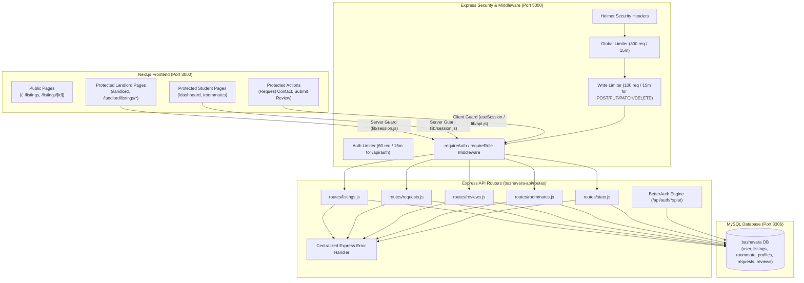

# BashaVara Full-Stack API Architecture & Endpoints Matrix

This document provides a comprehensive tracking reference for **every frontend API call**, **every backend API endpoint**, their **exact file locations**, request/response payloads, authentication & role requirements, client/server utilities, route guards, Zod validation schemas, database schema mappings, security hardening, and error handling contracts.

---

## 1. System Architecture & Route Guards Overview



### Route Guard Matrix (Next.js vs Express API)
| Route / Page | Access Level | Frontend Server/Client Guard | Behavior If Unauthorized | Backend Security |
|---|---|---|---|---|
| `/` | **Public** | None | Allowed | Public `GET /api/stats` & `GET /api/listings` |
| `/listings` | **Public** | None | Allowed | Public `GET /api/listings` (with filters & pagination) |
| `/listings/[id]` | **Public** | None (Page is public) | Allowed | Public `GET /api/listings/:id` |
| `/listings/[id]` *(Request Contact)* | **Protected (Student)** | Client Guard (`ListingDetailClient.jsx`) | Redirects to `/login` | `requireAuth` + `writeLimiter` on `POST /api/requests` |
| `/listings/[id]` *(Submit Review)* | **Protected (Student)** | Client Guard (`ListingDetailClient.jsx`) | Redirects to `/login` | `requireAuth` + `writeLimiter` on `POST /api/listings/:id/reviews` |
| `/roommates` | **Protected (Student)** | Server Guard ([`(student)/roommates/page.jsx`](file:///f:/BashaVara%20-%20Web/bashavara/src/app/(student)/roommates/page.jsx)) | Redirects to `/login` | `GET /api/roommates` (excludes self) & `PUT /api/me/profile` |
| `/dashboard` | **Protected (Student)** | Server Guard ([`(student)/dashboard/page.jsx`](file:///f:/BashaVara%20-%20Web/bashavara/src/app/(student)/dashboard/page.jsx)) | Redirects to `/login` (or `/landlord` if role=landlord) | `GET /api/requests/incoming` & `/outgoing` |
| `/landlord/*` | **Protected (Landlord)** | Server Guard ([`(landlord)/layout.jsx`](file:///f:/BashaVara%20-%20Web/bashavara/src/app/(landlord)/layout.jsx)) | Redirects to `/login?role=landlord` (or `/dashboard` if role≠landlord) | `requireRole("landlord")` on all landlord write endpoints |

---

## 2. Complete Backend Routes & Handlers Matrix

All route handlers live in [`bashavara-api/routes/`](file:///f:/BashaVara%20-%20Web/bashavara/bashavara-api/routes) with Zod validation, parameterized MySQL queries (`?` placeholders), and scoped database query helpers.

### 🏠 A. Listings (`routes/listings.js`)
| Method | Endpoint | Access / Middleware | Zod Validation | Description & Rules |
|---|---|---|---|---|
| `GET` | `/api/listings` | Public | Query: `minPrice`, `maxPrice`, `bedrooms`, `bathrooms`, `department`, `status`, `sort`, `page`, `limit` | Lists properties with filters, sorting, pagination (`page`, `limit`, `totalPages`, `total`), aggregated amenities, `avgRating`, and `reviewCount`. |
| `GET` | `/api/listings/:id` | Public | Path param: `id` | Returns single listing detail, amenities, landlord contact info, and full reviews list. |
| `POST` | `/api/listings` | `requireRole("landlord")` + `writeLimiter` | `createListingSchema` (title, address, rent, utilityCharge, bedrooms, distance, etc.) | Creates new property with normalized amenities under authenticated `landlord_id`. |
| `PATCH`| `/api/listings/:id` | `requireRole("landlord")` + `writeLimiter` | `updateListingSchema` (partial update) | Updates property. **Ownership check enforced** (`WHERE id = ? AND landlord_id = ?`). Non-owners receive `403 Forbidden`. |
| `PATCH`| `/api/listings/:id/status` | `requireRole("landlord")` + `writeLimiter` | `updateStatusSchema` (`active` \| `paused` \| `rented`) | Changes listing status. **Ownership check enforced**. Non-owners receive `403 Forbidden`. |
| `DELETE`| `/api/listings/:id` | `requireRole("landlord")` + `writeLimiter` | Path param: `id` | Deletes property and cascades associated amenities & reviews. **Ownership check enforced**. Non-owners receive `403 Forbidden`. |

---

### 📩 B. Requests (`routes/requests.js`)
| Method | Endpoint | Access / Middleware | Zod Validation | Description & Rules |
|---|---|---|---|---|
| `POST` | `/api/requests` | `requireAuth` + `writeLimiter` | `createRequestSchema` (`receiverId`, `listingId?`, `type`, `message?`) | Submits booking application or roommate invite. Prevents self-requests. |
| `GET` | `/api/requests/incoming` | `requireAuth` | None | Lists received requests. **Privacy Rule:** Sender email is returned **ONLY** when `status = 'accepted'`. |
| `GET` | `/api/requests/outgoing` | `requireAuth` | None | Lists sent requests. **Privacy Rule:** Receiver email is returned **ONLY** when `status = 'accepted'`. |
| `PATCH`| `/api/requests/:id` | `requireAuth` + `writeLimiter` | `updateStatusSchema` (`accepted` \| `rejected` \| `declined`) | **Receiver-only authorization.** Accepts or declines request. Unlocks contact emails upon acceptance. |

---

### ⭐ C. Reviews (`routes/reviews.js`)
| Method | Endpoint | Access / Middleware | Zod Validation | Description & Rules |
|---|---|---|---|---|
| `POST` | `/api/listings/:id/reviews` | `requireAuth` + `writeLimiter` | `createReviewSchema` (`rating` 1–5, `comment`) | Submits a review. **Enforces 1 review per user per listing**. Verifies tenant interaction. Landlords cannot review own listings. |
| `GET` | `/api/listings/:id/reviews` | Public | Path param: `id` | Fetches all verified student reviews for a listing. |

---

### 👥 D. Roommates & Profiles (`routes/roommates.js`)
| Method | Endpoint | Access / Middleware | Zod Validation | Description & Rules |
|---|---|---|---|---|
| `GET` | `/api/roommates` | Public / Session | Query: `department`, `budgetMax`, `sleepSchedule`, `smokingPreference` | Lists other student profiles. **Excludes the authenticated user's own profile**. |
| `GET` | `/api/me/profile` | `requireAuth` | None | Returns the logged-in student's personal info and roommate matching preferences. |
| `PUT` | `/api/me/profile` | `requireAuth` + `writeLimiter` | `profileSchema` (`budget`, `department`, `sleepSchedule`, `smokingPreference`, `bio`) | Upserts student roommate preferences in `roommate_profiles` (`ON DUPLICATE KEY UPDATE`). |

---

### 📊 E. Stats (`routes/stats.js`)
| Method | Endpoint | Access / Middleware | Description & Output |
|---|---|---|---|
| `GET` | `/api/stats` | Public | Real-time database metrics replacing mock stats: `activeListings`, `verifiedStudents`, `verifiedLandlords`, `averageRating`, `successfulMatches`. |
| `GET` | `/api/stats/landlord` | `requireRole("landlord")` | Aggregated dashboard stats: `totalListings`, `activeListings`, `totalApplications`, `pendingApplications`, `acceptedApplications`. |

---

## 3. Security, Hardening & Error Handling Contract

### A. Security Stack
1. **Helmet**: `app.use(helmet())` enforces standard HTTP security headers (X-Content-Type-Options, Strict-Transport-Security, X-Frame-Options, etc.).
2. **Global Rate Limiter**: 300 requests per 15-minute window per IP.
3. **Write Route Rate Limiter**: 100 modifying requests (`POST`, `PUT`, `PATCH`, `DELETE`) per 15-minute window per IP.
4. **Auth Rate Limiter**: 60 authentication attempts per 15-minute window per IP on `/api/auth`.
5. **CORS with Credentials**: Configured with `credentials: true` and `origin: FRONTEND_URL`.
6. **Parameterized Queries**: 100% of SQL queries use `mysql2` placeholders (`?`) to prevent SQL injection vulnerabilities.
7. **Strict Zod Body Validation**: Every request payload is validated with strict type coercion and bounds checking before database operations.

### B. Centralized Express Error Handler Contract
All unhandled errors, validation failures, and 404 routes emit structured, predictable JSON:
```json
{
  "error": "ValidationError | Forbidden | Unauthorized | NotFound | ServerError",
  "message": "Human readable error summary",
  "errors": {
    "field": ["Specific validation error message"]
  }
}
```

### C. Role & Ownership Isolation
- **Student accessing Landlord route**: Returns `403 Forbidden` (`Access denied. This action requires the 'landlord' role.`).
- **Landlord editing another Landlord's listing**: Returns `403 Forbidden` (`You can only update your own listings`).

---

## 4. Database Schema Reference ([schema.sql](file:///f:/BashaVara%20-%20Web/bashavara/bashavara-api/schema.sql))

All foreign keys targeting BetterAuth users use `VARCHAR(36)` strings.

```sql
-- 1. BetterAuth Users
CREATE TABLE `user` (
  `id` VARCHAR(36) NOT NULL PRIMARY KEY,
  `name` VARCHAR(255) NOT NULL,
  `email` VARCHAR(255) NOT NULL UNIQUE,
  `emailVerified` BOOLEAN NOT NULL DEFAULT FALSE,
  `image` TEXT NULL,
  `createdAt` TIMESTAMP NOT NULL DEFAULT CURRENT_TIMESTAMP,
  `updatedAt` TIMESTAMP NOT NULL DEFAULT CURRENT_TIMESTAMP ON UPDATE CURRENT_TIMESTAMP,
  `role` VARCHAR(50) NOT NULL DEFAULT 'student',
  `phone` VARCHAR(50) NULL,
  `businessName` VARCHAR(255) NULL
);

-- 2. Roommate Profiles
CREATE TABLE `roommate_profiles` (
  `user_id` VARCHAR(36) NOT NULL PRIMARY KEY,
  `budget` INT NOT NULL DEFAULT 1000,
  `department` VARCHAR(100) NULL,
  `sleep_schedule` VARCHAR(50) NULL DEFAULT 'Flexible',
  `smoking_preference` VARCHAR(50) NULL DEFAULT 'Non-Smoker',
  `bio` TEXT NULL,
  `created_at` TIMESTAMP NOT NULL DEFAULT CURRENT_TIMESTAMP,
  `updated_at` TIMESTAMP NOT NULL DEFAULT CURRENT_TIMESTAMP ON UPDATE CURRENT_TIMESTAMP,
  FOREIGN KEY (`user_id`) REFERENCES `user` (`id`) ON DELETE CASCADE
);

-- 3. Listings
CREATE TABLE `listings` (
  `id` VARCHAR(36) NOT NULL PRIMARY KEY,
  `landlord_id` VARCHAR(36) NOT NULL,
  `title` VARCHAR(255) NOT NULL,
  `address` VARCHAR(255) NOT NULL,
  `description` TEXT NOT NULL,
  `rent` DECIMAL(10,2) NOT NULL,
  `utility_charge` DECIMAL(10,2) NOT NULL DEFAULT 0.00,
  `distance` VARCHAR(100) NULL,
  `bedrooms` INT NOT NULL DEFAULT 1,
  `bathrooms` INT NOT NULL DEFAULT 1,
  `department_relevance` VARCHAR(255) NULL DEFAULT 'Any',
  `photo_url` TEXT NULL,
  `available_from` VARCHAR(100) NULL,
  `status` ENUM('active', 'paused', 'rented') NOT NULL DEFAULT 'active',
  `created_at` TIMESTAMP NOT NULL DEFAULT CURRENT_TIMESTAMP,
  `updated_at` TIMESTAMP NOT NULL DEFAULT CURRENT_TIMESTAMP ON UPDATE CURRENT_TIMESTAMP,
  FOREIGN KEY (`landlord_id`) REFERENCES `user` (`id`) ON DELETE CASCADE
);

-- 4. Listing Amenities
CREATE TABLE `listing_amenities` (
  `id` INT AUTO_INCREMENT PRIMARY KEY,
  `listing_id` VARCHAR(36) NOT NULL,
  `amenity` VARCHAR(100) NOT NULL,
  FOREIGN KEY (`listing_id`) REFERENCES `listings` (`id`) ON DELETE CASCADE,
  UNIQUE KEY `uk_listing_amenity` (`listing_id`, `amenity`)
);

-- 5. Unified Requests (Listing Inquiries & Roommate Connections)
CREATE TABLE `requests` (
  `id` VARCHAR(36) NOT NULL PRIMARY KEY,
  `sender_id` VARCHAR(36) NOT NULL,
  `receiver_id` VARCHAR(36) NOT NULL,
  `listing_id` VARCHAR(36) NULL,
  `type` ENUM('listing', 'roommate') NOT NULL,
  `status` ENUM('pending', 'accepted', 'rejected') NOT NULL DEFAULT 'pending',
  `message` TEXT NULL,
  `created_at` TIMESTAMP NOT NULL DEFAULT CURRENT_TIMESTAMP,
  `updated_at` TIMESTAMP NOT NULL DEFAULT CURRENT_TIMESTAMP ON UPDATE CURRENT_TIMESTAMP,
  FOREIGN KEY (`sender_id`) REFERENCES `user` (`id`) ON DELETE CASCADE,
  FOREIGN KEY (`receiver_id`) REFERENCES `user` (`id`) ON DELETE CASCADE,
  FOREIGN KEY (`listing_id`) REFERENCES `listings` (`id`) ON DELETE SET NULL
);

-- 6. Reviews
CREATE TABLE `reviews` (
  `id` VARCHAR(36) NOT NULL PRIMARY KEY,
  `listing_id` VARCHAR(36) NOT NULL,
  `reviewer_id` VARCHAR(36) NOT NULL,
  `rating` INT NOT NULL CHECK (`rating` >= 1 AND `rating` <= 5),
  `comment` TEXT NULL,
  `created_at` TIMESTAMP NOT NULL DEFAULT CURRENT_TIMESTAMP,
  FOREIGN KEY (`listing_id`) REFERENCES `listings` (`id`) ON DELETE CASCADE,
  FOREIGN KEY (`reviewer_id`) REFERENCES `user` (`id`) ON DELETE CASCADE,
  UNIQUE KEY `uk_listing_reviewer` (`listing_id`, `reviewer_id`)
);
```

---

## 5. Seed Data, CLI Migration Commands & Environment Setup

### Environment Variables
- Root Frontend Template: [`.env.example`](file:///f:/BashaVara%20-%20Web/bashavara/.env.example) (`NEXT_PUBLIC_API_URL=http://localhost:5000`)
- Backend API Template: [`bashavara-api/.env.example`](file:///f:/BashaVara%20-%20Web/bashavara/bashavara-api/.env.example) (`PORT`, `DATABASE_URL`, `BETTER_AUTH_SECRET`, `BETTER_AUTH_URL`, `FRONTEND_URL`, `COOKIE_SAME_SITE`, `COOKIE_SECURE`)
- Git Configuration: [`.gitignore`](file:///f:/BashaVara%20-%20Web/bashavara/.gitignore) ignores `.env*` secret files while tracking `!.env.example`.

### CLI Commands
- **Migrate Database Schema:** `npm run migrate` (in `bashavara-api`) creates all tables in MySQL.
- **Seed Database from `public/data.json`:** `npm run seed` populates:
  - `9` Users (8 students with full roommate preference profiles + 1 landlord)
  - `14` Properties in `listings` table with all corresponding `listing_amenities`
  - `8` Reviews in `reviews` table
  - `12` Unified requests in `requests` table (both student roommate invites & landlord listing applications)

---

## 6. Production Deployment & Cross-Site Cookie Architecture

### A. Cross-Origin Cookie Contract
When Next.js runs on Vercel (`https://bashavara.vercel.app`) and Express API runs on Render / Railway (`https://bashavara-api.onrender.com`):
1. **Cookie Attributes**: In production (`NODE_ENV=production`), BetterAuth cookies are automatically set to `SameSite=None; Secure; HttpOnly`.
2. **Reverse Proxy Trust**: `app.set("trust proxy", 1)` is enabled in [`index.js`](file:///f:/BashaVara%20-%20Web/bashavara/bashavara-api/index.js) so Express correctly identifies HTTPS headers forwarded by Render/Railway.
3. **CORS Headers**: Dynamic origin matcher verifies against `process.env.FRONTEND_URL` and passes `Access-Control-Allow-Credentials: true`.
4. **Credential Inclusion**: All client `fetch` calls use `credentials: "include"`, while Server Components forward cookie headers via `cookies()` in [`lib/session.js`](file:///f:/BashaVara%20-%20Web/bashavara/src/lib/session.js) and [`lib/api.js`](file:///f:/BashaVara%20-%20Web/bashavara/src/lib/api.js).

### B. Automated End-to-End User Flow Test (`test-flow.js`)
The test script [`bashavara-api/test-flow.js`](file:///f:/BashaVara%20-%20Web/bashavara/bashavara-api/test-flow.js) programmatically validates:
1. **Student Registration**: `.edu` domain enforced.
2. **Landlord Registration**: Required phone and businessName validated.
3. **Listing Creation**: Landlord posts property with Zod schema validation.
4. **Contact Request**: Student sends inquiry to landlord; contact email masked.
5. **Request Acceptance**: Landlord accepts request; contact email unlocked.
6. **Verified Review**: Student submits 5-star rating & review on the property.
7. **Role Security**: Student blocked from accessing landlord route (`403 Forbidden`).
8. **Ownership Security**: Landlord blocked from modifying another landlord's listing (`403 Forbidden`).
