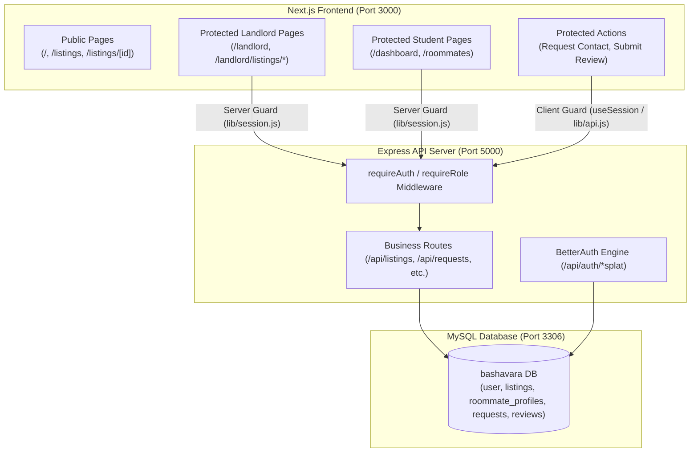

# BashaVara Full-Stack API Architecture & Endpoints Matrix

This document provides a comprehensive tracking reference for **every frontend API call**, **every backend API endpoint**, their **exact file locations**, request/response payloads, authentication & role requirements, client/server utilities, route guards, and database schema mappings.

---

## 1. System Architecture & Route Guards Overview



### Route Guard Matrix (Next.js vs Express API)
| Route / Page | Access Level | Frontend Server/Client Guard | Behavior If Unauthorized | Backend Security |
|---|---|---|---|---|
| `/` | **Public** | None | Allowed | N/A |
| `/listings` | **Public** | None | Allowed | Public `GET /api/listings` |
| `/listings/[id]` | **Public** | None (Page is public) | Allowed | Public `GET /api/listings/:id` |
| `/listings/[id]` *(Request Contact)* | **Protected (Student)** | Client Guard (`ListingDetailClient.jsx`) | Redirects to `/login` | `requireRole("student")` on `POST /api/requests` |
| `/listings/[id]` *(Submit Review)* | **Protected (Student)** | Client Guard (`ListingDetailClient.jsx`) | Redirects to `/login` | `requireRole("student")` on `POST /api/reviews` |
| `/roommates` | **Protected (Student)** | Server Guard ([`(student)/roommates/page.jsx`](file:///f:/BashaVara%20-%20Web/bashavara/src/app/(student)/roommates/page.jsx)) | Redirects to `/login` | `requireRole("student")` on `GET /api/roommates` |
| `/dashboard` | **Protected (Student)** | Server Guard ([`(student)/dashboard/page.jsx`](file:///f:/BashaVara%20-%20Web/bashavara/src/app/(student)/dashboard/page.jsx)) | Redirects to `/login` (or `/landlord` if role=landlord) | `requireRole("student")` on `GET /api/student/dashboard` |
| `/landlord/*` | **Protected (Landlord)** | Server Guard ([`(landlord)/layout.jsx`](file:///f:/BashaVara%20-%20Web/bashavara/src/app/(landlord)/layout.jsx)) | Redirects to `/login?role=landlord` (or `/dashboard` if role≠landlord) | `requireRole("landlord")` on all `/api/landlord/*` routes |

---

## 2. Frontend to Backend API Calls Matrix

| # | Feature / Action | Frontend Component / Page | Method & Endpoint | Payload / Params | Auth / Role Required | Expected Response | Backend Handler Position |
|---|---|---|---|---|---|---|---|
| **1** | **User Registration** | [`RegisterForm.jsx`](file:///f:/BashaVara%20-%20Web/bashavara/src/components/RegisterForm.jsx) | `POST /api/auth/sign-up/email` | `{ name, email, password, role, phone?, businessName? }` | Public (`.edu` enforced on student, phone required on landlord) | `{ token, user: { id, name, email, role, phone, businessName } }` | [`bashavara-api/auth.js`](file:///f:/BashaVara%20-%20Web/bashavara/bashavara-api/auth.js) *(BetterAuth hook)* |
| **2** | **User Login** | [`LoginForm.jsx`](file:///f:/BashaVara%20-%20Web/bashavara/src/components/LoginForm.jsx) | `POST /api/auth/sign-in/email` | `{ email, password }` | Public (Validates actual role matches UI toggle) | `{ token, user: { id, name, email, role } }` | [`bashavara-api/auth.js`](file:///f:/BashaVara%20-%20Web/bashavara/bashavara-api/auth.js) *(BetterAuth)* |
| **3** | **User Logout** | [`Navbar.jsx`](file:///f:/BashaVara%20-%20Web/bashavara/src/components/Navbar.jsx) | `POST /api/auth/sign-out` | None | Active Session | `{ success: true }` | [`bashavara-api/auth.js`](file:///f:/BashaVara%20-%20Web/bashavara/bashavara-api/auth.js) *(BetterAuth)* |
| **4** | **Client Session Hook** | [`useSession.js`](file:///f:/BashaVara%20-%20Web/bashavara/src/hooks/useSession.js) / [`Navbar.jsx`](file:///f:/BashaVara%20-%20Web/bashavara/src/components/Navbar.jsx) | `GET /api/auth/get-session` | None (`credentials: "include"`) | Client Session | `{ session, user: { id, name, email, role, phone, businessName } }` | [`bashavara-api/auth.js`](file:///f:/BashaVara%20-%20Web/bashavara/bashavara-api/auth.js) *(BetterAuth)* |
| **5** | **Server Session Helper** | [`lib/session.js`](file:///f:/BashaVara%20-%20Web/bashavara/src/lib/session.js) | `GET /api/auth/get-session` | Forwards `Cookie` header from `cookies()` | Server Component Session | `{ session, user: { id, name, email, role, phone, businessName } }` | [`bashavara-api/auth.js`](file:///f:/BashaVara%20-%20Web/bashavara/bashavara-api/auth.js) *(BetterAuth)* |
| **6** | **Fetch All Listings** | [`(student)/listings/page.jsx`](file:///f:/BashaVara%20-%20Web/bashavara/src/app/(student)/listings/page.jsx) | `GET /api/listings` | Query: `?location=&minPrice=&maxPrice=&gender=&type=` | Public | `[{ id, title, rent, location, gender, photos, ... }]` | [`routes/listings.js`](file:///f:/BashaVara%20-%20Web/bashavara/bashavara-api/routes/listings.js) `getAllListings` |
| **7** | **Fetch Listing Detail** | [`ListingDetailClient.jsx`](file:///f:/BashaVara%20-%20Web/bashavara/src/app/(student)/listings/[id]/ListingDetailClient.jsx) | `GET /api/listings/:id` | Path Param: `id` | Public | `{ id, title, rent, landlord: { name, phone }, amenities, ... }` | [`routes/listings.js`](file:///f:/BashaVara%20-%20Web/bashavara/bashavara-api/routes/listings.js) `getListingById` |
| **8** | **Create New Listing** | `(landlord)/landlord/listings/new` | `POST /api/listings` | `{ title, description, rent, utilityCharge, address, bedrooms, bathrooms, departmentRelevance, photoUrl, amenities }` | `requireRole("landlord")` | `{ success: true, listingId, listing }` | [`routes/listings.js`](file:///f:/BashaVara%20-%20Web/bashavara/bashavara-api/routes/listings.js) `createListing` |
| **9** | **Update Listing** | `(landlord)/landlord/listings/[id]` | `PUT /api/listings/:id` | Partial listing object | `requireRole("landlord")` (Owner check) | `{ success: true, listing }` | [`routes/listings.js`](file:///f:/BashaVara%20-%20Web/bashavara/bashavara-api/routes/listings.js) `updateListing` |
| **10** | **Delete Listing** | [`LandlordDashboardClient.jsx`](file:///f:/BashaVara%20-%20Web/bashavara/src/app/(landlord)/landlord/LandlordDashboardClient.jsx) | `DELETE /api/listings/:id` | Path Param: `id` | `requireRole("landlord")` (Owner check) | `{ success: true, message: "Listing deleted" }` | [`routes/listings.js`](file:///f:/BashaVara%20-%20Web/bashavara/bashavara-api/routes/listings.js) `deleteListing` |
| **11** | **Landlord Dashboard Stats** | [`LandlordDashboardClient.jsx`](file:///f:/BashaVara%20-%20Web/bashavara/src/app/(landlord)/landlord/LandlordDashboardClient.jsx) | `GET /api/landlord/stats` | None | `requireRole("landlord")` | `{ totalListings, activeListings, totalApplications, pendingCount }` | [`routes/landlord.js`](file:///f:/BashaVara%20-%20Web/bashavara/bashavara-api/routes/landlord.js) `getLandlordStats` |
| **12** | **Landlord's Own Listings** | [`LandlordDashboardClient.jsx`](file:///f:/BashaVara%20-%20Web/bashavara/src/app/(landlord)/landlord/LandlordDashboardClient.jsx) | `GET /api/landlord/listings` | None | `requireRole("landlord")` | `[{ id, title, rent, status, views, applicationsCount, ... }]` | [`routes/landlord.js`](file:///f:/BashaVara%20-%20Web/bashavara/bashavara-api/routes/landlord.js) `getMyListings` |
| **13** | **Submit Booking / Listing Request** | [`ListingDetailClient.jsx`](file:///f:/BashaVara%20-%20Web/bashavara/src/app/(student)/listings/[id]/ListingDetailClient.jsx) | `POST /api/requests` | `{ receiverId, listingId, type: "listing", message? }` | `requireRole("student")` | `{ success: true, request: { id, status: "pending" } }` | [`routes/requests.js`](file:///f:/BashaVara%20-%20Web/bashavara/bashavara-api/routes/requests.js) `createRequest` |
| **14** | **Landlord View Inquiries/Requests** | [`LandlordDashboardClient.jsx`](file:///f:/BashaVara%20-%20Web/bashavara/src/app/(landlord)/landlord/LandlordDashboardClient.jsx) | `GET /api/requests?type=listing` | Query: `?status=&listingId=` | `requireRole("landlord")` | `[{ id, listingTitle, sender: { name, email, phone }, status, ... }]` | [`routes/requests.js`](file:///f:/BashaVara%20-%20Web/bashavara/bashavara-api/routes/requests.js) `getReceivedRequests` |
| **15** | **Update Request Status** | [`LandlordDashboardClient.jsx`](file:///f:/BashaVara%20-%20Web/bashavara/src/app/(landlord)/landlord/LandlordDashboardClient.jsx) | `PATCH /api/requests/:id/status` | `{ status: "accepted" \| "rejected" }` | Receiver Auth Check | `{ success: true, status }` | [`routes/requests.js`](file:///f:/BashaVara%20-%20Web/bashavara/bashavara-api/routes/requests.js) `updateStatus` |
| **16** | **Student Dashboard Data** | [`(student)/dashboard/page.jsx`](file:///f:/BashaVara%20-%20Web/bashavara/src/app/(student)/dashboard/page.jsx) | `GET /api/student/dashboard` | None | `requireRole("student")` | `{ requests: [], savedListings: [], matches: [] }` | [`routes/student.js`](file:///f:/BashaVara%20-%20Web/bashavara/bashavara-api/routes/student.js) `getStudentDashboard` |
| **17** | **Fetch Roommate Profiles** | [`(student)/roommates/page.jsx`](file:///f:/BashaVara%20-%20Web/bashavara/src/app/(student)/roommates/page.jsx) | `GET /api/roommates` | Query: `?department=&budget=&sleepSchedule=` | `requireRole("student")` | `[{ user_id, user: { name, email }, department, budget, bio, ... }]` | [`routes/roommates.js`](file:///f:/BashaVara%20-%20Web/bashavara/bashavara-api/routes/roommates.js) `getRoommates` |
| **18** | **Upsert Roommate Profile** | [`(student)/roommates/page.jsx`](file:///f:/BashaVara%20-%20Web/bashavara/src/app/(student)/roommates/page.jsx) | `POST /api/roommates/profile` | `{ budget, department, sleepSchedule, smokingPreference, bio }` | `requireRole("student")` | `{ success: true, profile }` | [`routes/roommates.js`](file:///f:/BashaVara%20-%20Web/bashavara/bashavara-api/routes/roommates.js) `upsertProfile` |
| **19** | **Send Roommate Connection Request**| [`(student)/roommates/page.jsx`](file:///f:/BashaVara%20-%20Web/bashavara/src/app/(student)/roommates/page.jsx) | `POST /api/requests` | `{ receiverId, type: "roommate", message? }` | `requireRole("student")` | `{ success: true, request: { id, status: "pending" } }` | [`routes/requests.js`](file:///f:/BashaVara%20-%20Web/bashavara/bashavara-api/routes/requests.js) `createRequest` |
| **20** | **Submit Listing Review** | [`ListingDetailClient.jsx`](file:///f:/BashaVara%20-%20Web/bashavara/src/app/(student)/listings/[id]/ListingDetailClient.jsx) | `POST /api/reviews` | `{ listingId, rating, comment }` | `requireRole("student")` | `{ success: true, review }` | [`routes/reviews.js`](file:///f:/BashaVara%20-%20Web/bashavara/bashavara-api/routes/reviews.js) `createReview` |

---

## 3. Database Schema Reference ([schema.sql](file:///f:/BashaVara%20-%20Web/bashavara/bashavara-api/schema.sql))

All foreign keys targeting BetterAuth users use `VARCHAR(36)` strings.

```sql
-- 1. BetterAuth Users
CREATE TABLE `user` (
  `id` VARCHAR(36) NOT NULL PRIMARY KEY,
  `name` VARCHAR(255) NOT NULL,
  `email` VARCHAR(255) NOT NULL UNIQUE,
  `emailVerified` BOOLEAN NOT NULL DEFAULT FALSE,
  `image` TEXT NULL,
  `createdAt` TIMESTAMP NOT NULL DEFAULT CURRENT_TIMESTAMP,
  `updatedAt` TIMESTAMP NOT NULL DEFAULT CURRENT_TIMESTAMP ON UPDATE CURRENT_TIMESTAMP,
  `role` VARCHAR(50) NOT NULL DEFAULT 'student',
  `phone` VARCHAR(50) NULL,
  `businessName` VARCHAR(255) NULL
);

-- 2. Roommate Profiles
CREATE TABLE `roommate_profiles` (
  `user_id` VARCHAR(36) NOT NULL PRIMARY KEY,
  `budget` INT NOT NULL DEFAULT 1000,
  `department` VARCHAR(100) NULL,
  `sleep_schedule` VARCHAR(50) NULL DEFAULT 'Flexible',
  `smoking_preference` VARCHAR(50) NULL DEFAULT 'Non-Smoker',
  `bio` TEXT NULL,
  `created_at` TIMESTAMP NOT NULL DEFAULT CURRENT_TIMESTAMP,
  `updated_at` TIMESTAMP NOT NULL DEFAULT CURRENT_TIMESTAMP ON UPDATE CURRENT_TIMESTAMP,
  FOREIGN KEY (`user_id`) REFERENCES `user` (`id`) ON DELETE CASCADE
);

-- 3. Listings
CREATE TABLE `listings` (
  `id` VARCHAR(36) NOT NULL PRIMARY KEY,
  `landlord_id` VARCHAR(36) NOT NULL,
  `title` VARCHAR(255) NOT NULL,
  `address` VARCHAR(255) NOT NULL,
  `description` TEXT NOT NULL,
  `rent` DECIMAL(10,2) NOT NULL,
  `utility_charge` DECIMAL(10,2) NOT NULL DEFAULT 0.00,
  `distance` VARCHAR(100) NULL,
  `bedrooms` INT NOT NULL DEFAULT 1,
  `bathrooms` INT NOT NULL DEFAULT 1,
  `department_relevance` VARCHAR(255) NULL DEFAULT 'Any',
  `photo_url` TEXT NULL,
  `available_from` VARCHAR(100) NULL,
  `status` ENUM('active', 'paused', 'rented') NOT NULL DEFAULT 'active',
  `created_at` TIMESTAMP NOT NULL DEFAULT CURRENT_TIMESTAMP,
  `updated_at` TIMESTAMP NOT NULL DEFAULT CURRENT_TIMESTAMP ON UPDATE CURRENT_TIMESTAMP,
  FOREIGN KEY (`landlord_id`) REFERENCES `user` (`id`) ON DELETE CASCADE
);

-- 4. Listing Amenities
CREATE TABLE `listing_amenities` (
  `id` INT AUTO_INCREMENT PRIMARY KEY,
  `listing_id` VARCHAR(36) NOT NULL,
  `amenity` VARCHAR(100) NOT NULL,
  FOREIGN KEY (`listing_id`) REFERENCES `listings` (`id`) ON DELETE CASCADE,
  UNIQUE KEY `uk_listing_amenity` (`listing_id`, `amenity`)
);

-- 5. Unified Requests (Listing Inquiries & Roommate Connections)
CREATE TABLE `requests` (
  `id` VARCHAR(36) NOT NULL PRIMARY KEY,
  `sender_id` VARCHAR(36) NOT NULL,
  `receiver_id` VARCHAR(36) NOT NULL,
  `listing_id` VARCHAR(36) NULL,
  `type` ENUM('listing', 'roommate') NOT NULL,
  `status` ENUM('pending', 'accepted', 'rejected') NOT NULL DEFAULT 'pending',
  `message` TEXT NULL,
  `created_at` TIMESTAMP NOT NULL DEFAULT CURRENT_TIMESTAMP,
  `updated_at` TIMESTAMP NOT NULL DEFAULT CURRENT_TIMESTAMP ON UPDATE CURRENT_TIMESTAMP,
  FOREIGN KEY (`sender_id`) REFERENCES `user` (`id`) ON DELETE CASCADE,
  FOREIGN KEY (`receiver_id`) REFERENCES `user` (`id`) ON DELETE CASCADE,
  FOREIGN KEY (`listing_id`) REFERENCES `listings` (`id`) ON DELETE SET NULL
);

-- 6. Reviews
CREATE TABLE `reviews` (
  `id` VARCHAR(36) NOT NULL PRIMARY KEY,
  `listing_id` VARCHAR(36) NOT NULL,
  `reviewer_id` VARCHAR(36) NOT NULL,
  `rating` INT NOT NULL CHECK (`rating` >= 1 AND `rating` <= 5),
  `comment` TEXT NULL,
  `created_at` TIMESTAMP NOT NULL DEFAULT CURRENT_TIMESTAMP,
  FOREIGN KEY (`listing_id`) REFERENCES `listings` (`id`) ON DELETE CASCADE,
  FOREIGN KEY (`reviewer_id`) REFERENCES `user` (`id`) ON DELETE CASCADE,
  UNIQUE KEY `uk_listing_reviewer` (`listing_id`, `reviewer_id`)
);
```

---

## 4. Seed Data & CLI Migration Commands

- **Migrate Database Schema:** `npm run migrate` (in `bashavara-api`) creates all tables in MySQL.
- **Seed Database from `public/data.json`:** `npm run seed` populates:
  - `9` Users (8 students with full roommate preference profiles + 1 landlord)
  - `14` Properties in `listings` table with all corresponding `listing_amenities`
  - `8` Reviews in `reviews` table
  - `12` Unified requests in `requests` table (both student roommate invites & landlord listing applications)
