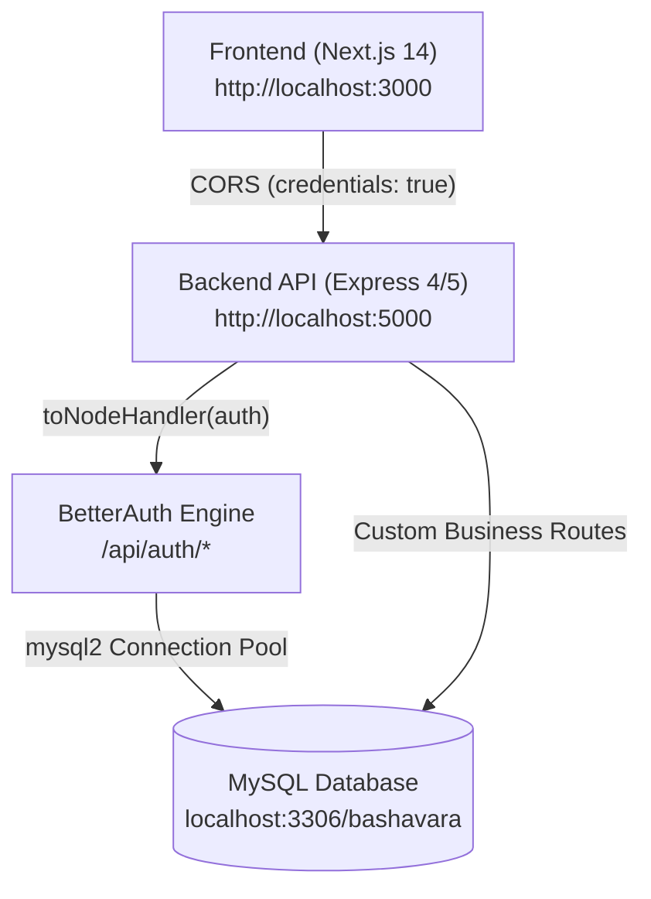

# BashaVara Full-Stack API Architecture & Endpoints Matrix

This document provides a comprehensive tracking reference for **every frontend API call**, **every backend API endpoint**, their **exact file locations**, request/response payloads, authentication & role requirements, and database schema mappings.

---

## 1. System Architecture Overview



- **Frontend:** Next.js (Port `3000`) with `@/lib/auth-client.js` (`createAuthClient` with `credentials: "include"`).
- **Backend API:** Express server in [`bashavara-api/`](file:///f:/BashaVara%20-%20Web/bashavara/bashavara-api) (Port `5000`).
- **Authentication:** BetterAuth mounted under `/api/auth/*splat` with custom `additionalFields` (`role`, `phone`, `businessName`) and server-side `.edu` hook.
- **Database:** MySQL database `bashavara` with connection pool in [`bashavara-api/db.js`](file:///f:/BashaVara%20-%20Web/bashavara/bashavara-api/db.js).

---

## 2. Frontend to Backend API Calls Matrix

| # | Feature / Action | Frontend Component / Page | Method & Endpoint | Payload / Params | Auth / Role Required | Expected Response | Backend Handler Position |
|---|---|---|---|---|---|---|---|
| **1** | **User Registration** | [`RegisterForm.jsx`](file:///f:/BashaVara%20-%20Web/bashavara/src/components/RegisterForm.jsx) | `POST /api/auth/sign-up/email` | `{ name, email, password, role, phone?, businessName? }` | Public (`.edu` required for student) | `{ token, user: { id, name, email, role, phone, businessName } }` | [`auth.js`](file:///f:/BashaVara%20-%20Web/bashavara/bashavara-api/auth.js) *(BetterAuth hook)* |
| **2** | **User Login** | [`LoginForm.jsx`](file:///f:/BashaVara%20-%20Web/bashavara/src/components/LoginForm.jsx) | `POST /api/auth/sign-in/email` | `{ email, password }` | Public | `{ token, user: { id, name, email, role } }` | [`auth.js`](file:///f:/BashaVara%20-%20Web/bashavara/bashavara-api/auth.js) *(BetterAuth)* |
| **3** | **User Logout** | [`Navbar.jsx`](file:///f:/BashaVara%20-%20Web/bashavara/src/components/Navbar.jsx) | `POST /api/auth/sign-out` | None | Active Session | `{ success: true }` | [`auth.js`](file:///f:/BashaVara%20-%20Web/bashavara/bashavara-api/auth.js) *(BetterAuth)* |
| **4** | **Get Current Session** | [`useSession.js`](file:///f:/BashaVara%20-%20Web/bashavara/src/hooks/useSession.js) / [`Navbar.jsx`](file:///f:/BashaVara%20-%20Web/bashavara/src/components/Navbar.jsx) | `GET /api/auth/get-session` | None (Cookies sent) | Public / Session | `{ session, user: { id, name, email, role, phone, businessName } }` | [`auth.js`](file:///f:/BashaVara%20-%20Web/bashavara/bashavara-api/auth.js) *(BetterAuth)* |
| **5** | **Fetch All Listings** | [`(student)/listings/page.jsx`](file:///f:/BashaVara%20-%20Web/bashavara/src/app/(student)/listings/page.jsx) | `GET /api/listings` | Query: `?location=&minPrice=&maxPrice=&gender=&type=` | Public | `[{ id, title, rent, location, gender, photos, ... }]` | [`routes/listings.js`](file:///f:/BashaVara%20-%20Web/bashavara/bashavara-api/routes/listings.js) `getAllListings` |
| **6** | **Fetch Listing Detail** | [`ListingDetailClient.jsx`](file:///f:/BashaVara%20-%20Web/bashavara/src/app/(student)/listings/[id]/ListingDetailClient.jsx) | `GET /api/listings/:id` | Path Param: `id` | Public | `{ id, title, rent, landlord: { name, phone }, amenities, ... }` | [`routes/listings.js`](file:///f:/BashaVara%20-%20Web/bashavara/bashavara-api/routes/listings.js) `getListingById` |
| **7** | **Create New Listing** | `(landlord)/landlord/listings/new` | `POST /api/listings` | `{ title, description, rent, deposit, location, bedrooms, bathrooms, gender, amenities, photos }` | `requireRole("landlord")` | `{ success: true, listingId, listing }` | [`routes/listings.js`](file:///f:/BashaVara%20-%20Web/bashavara/bashavara-api/routes/listings.js) `createListing` |
| **8** | **Update Listing** | `(landlord)/landlord/listings/[id]` | `PUT /api/listings/:id` | Partial listing object | `requireRole("landlord")` (Owner check) | `{ success: true, listing }` | [`routes/listings.js`](file:///f:/BashaVara%20-%20Web/bashavara/bashavara-api/routes/listings.js) `updateListing` |
| **9** | **Delete Listing** | [`LandlordDashboardClient.jsx`](file:///f:/BashaVara%20-%20Web/bashavara/src/app/(landlord)/landlord/LandlordDashboardClient.jsx) | `DELETE /api/listings/:id` | Path Param: `id` | `requireRole("landlord")` (Owner check) | `{ success: true, message: "Listing deleted" }` | [`routes/listings.js`](file:///f:/BashaVara%20-%20Web/bashavara/bashavara-api/routes/listings.js) `deleteListing` |
| **10** | **Landlord Dashboard Stats** | [`LandlordDashboardClient.jsx`](file:///f:/BashaVara%20-%20Web/bashavara/src/app/(landlord)/landlord/LandlordDashboardClient.jsx) | `GET /api/landlord/stats` | None | `requireRole("landlord")` | `{ totalListings, activeListings, totalApplications, pendingCount }` | [`routes/landlord.js`](file:///f:/BashaVara%20-%20Web/bashavara/bashavara-api/routes/landlord.js) `getLandlordStats` |
| **11** | **Landlord's Own Listings** | [`LandlordDashboardClient.jsx`](file:///f:/BashaVara%20-%20Web/bashavara/src/app/(landlord)/landlord/LandlordDashboardClient.jsx) | `GET /api/landlord/listings` | None | `requireRole("landlord")` | `[{ id, title, rent, status, views, applicationsCount, ... }]` | [`routes/landlord.js`](file:///f:/BashaVara%20-%20Web/bashavara/bashavara-api/routes/landlord.js) `getMyListings` |
| **12** | **Submit Booking / Application** | [`ListingDetailClient.jsx`](file:///f:/BashaVara%20-%20Web/bashavara/src/app/(student)/listings/[id]/ListingDetailClient.jsx) | `POST /api/applications` | `{ listingId, message, moveInDate, phone }` | `requireRole("student")` | `{ success: true, application: { id, status: "pending" } }` | [`routes/applications.js`](file:///f:/BashaVara%20-%20Web/bashavara/bashavara-api/routes/applications.js) `createApplication` |
| **13** | **Landlord View Applications** | [`LandlordDashboardClient.jsx`](file:///f:/BashaVara%20-%20Web/bashavara/src/app/(landlord)/landlord/LandlordDashboardClient.jsx) | `GET /api/landlord/applications` | Query: `?status=&listingId=` | `requireRole("landlord")` | `[{ id, listingTitle, student: { name, email, phone }, status, ... }]` | [`routes/landlord.js`](file:///f:/BashaVara%20-%20Web/bashavara/bashavara-api/routes/landlord.js) `getApplications` |
| **14** | **Update Application Status** | [`LandlordDashboardClient.jsx`](file:///f:/BashaVara%20-%20Web/bashavara/src/app/(landlord)/landlord/LandlordDashboardClient.jsx) | `PATCH /api/applications/:id/status` | `{ status: "accepted" \| "rejected" }` | `requireRole("landlord")` | `{ success: true, status }` | [`routes/applications.js`](file:///f:/BashaVara%20-%20Web/bashavara/bashavara-api/routes/applications.js) `updateStatus` |
| **15** | **Student Dashboard Data** | [`(student)/dashboard/page.jsx`](file:///f:/BashaVara%20-%20Web/bashavara/src/app/(student)/dashboard/page.jsx) | `GET /api/student/dashboard` | None | `requireRole("student")` | `{ savedListings: [], myApplications: [], roommateMatches: [] }` | [`routes/student.js`](file:///f:/BashaVara%20-%20Web/bashavara/bashavara-api/routes/student.js) `getStudentDashboard` |
| **16** | **Fetch Roommate Profiles** | [`(student)/roommates/page.jsx`](file:///f:/BashaVara%20-%20Web/bashavara/src/app/(student)/roommates/page.jsx) | `GET /api/roommates` | Query: `?gender=&university=&budget=&cleanliness=` | `requireRole("student")` | `[{ id, user: { name, email }, university, budget, bio, habits }]` | [`routes/roommates.js`](file:///f:/BashaVara%20-%20Web/bashavara/bashavara-api/routes/roommates.js) `getRoommates` |
| **17** | **Upsert Roommate Profile** | [`(student)/roommates/page.jsx`](file:///f:/BashaVara%20-%20Web/bashavara/src/app/(student)/roommates/page.jsx) | `POST /api/roommates/profile` | `{ university, department, budget, gender, sleepSchedule, habits, bio }` | `requireRole("student")` | `{ success: true, profile }` | [`routes/roommates.js`](file:///f:/BashaVara%20-%20Web/bashavara/bashavara-api/routes/roommates.js) `upsertProfile` |
| **18** | **Send Roommate Request** | [`(student)/roommates/page.jsx`](file:///f:/BashaVara%20-%20Web/bashavara/src/app/(student)/roommates/page.jsx) | `POST /api/roommates/requests` | `{ targetUserId, message }` | `requireRole("student")` | `{ success: true, requestId, status: "pending" }` | [`routes/roommates.js`](file:///f:/BashaVara%20-%20Web/bashavara/bashavara-api/routes/roommates.js) `sendRoommateRequest` |
| **19** | **Toggle Save/Bookmark Listing** | [`ListingDetailClient.jsx`](file:///f:/BashaVara%20-%20Web/bashavara/src/app/(student)/listings/[id]/ListingDetailClient.jsx) | `POST /api/listings/:id/save` | None | `requireRole("student")` | `{ saved: true \| false }` | [`routes/listings.js`](file:///f:/BashaVara%20-%20Web/bashavara/bashavara-api/routes/listings.js) `toggleSaveListing` |

---

## 3. Backend API Endpoints & File Positions Matrix

| Endpoint Route | Method | Target Backend File | Middleware Stack | Database Operations | Description / Purpose |
|---|---|---|---|---|---|
| `/api/auth/*splat` | `ALL` | [`bashavara-api/auth.js`](file:///f:/BashaVara%20-%20Web/bashavara/bashavara-api/auth.js) | `authLimiter`, `cors` | `user`, `session`, `account`, `verification` | BetterAuth handler for sign-up, sign-in, session, OAuth, sign-out |
| `/health` | `GET` | [`bashavara-api/index.js`](file:///f:/BashaVara%20-%20Web/bashavara/bashavara-api/index.js) | Public | None | Health check & CORS sanity verification |
| `/api/me` | `GET` | [`bashavara-api/index.js`](file:///f:/BashaVara%20-%20Web/bashavara/bashavara-api/index.js) | `requireAuth` | `session`, `user` | Retrieves authenticated user profile & active session |
| `/api/listings` | `GET` | [`bashavara-api/routes/listings.js`](file:///f:/BashaVara%20-%20Web/bashavara/bashavara-api/routes/listings.js) | Public | `SELECT FROM listing` | Returns filtered list of housing listings |
| `/api/listings/:id` | `GET` | [`bashavara-api/routes/listings.js`](file:///f:/BashaVara%20-%20Web/bashavara/bashavara-api/routes/listings.js) | Public | `SELECT FROM listing JOIN user` | Returns full single listing details + landlord public info |
| `/api/listings` | `POST` | [`bashavara-api/routes/listings.js`](file:///f:/BashaVara%20-%20Web/bashavara/bashavara-api/routes/listings.js) | `requireRole("landlord")` | `INSERT INTO listing` | Creates a new rental property under landlord's `userId` |
| `/api/listings/:id` | `PUT` | [`bashavara-api/routes/listings.js`](file:///f:/BashaVara%20-%20Web/bashavara/bashavara-api/routes/listings.js) | `requireRole("landlord")` | `UPDATE listing WHERE id AND userId` | Updates an existing listing (owner verification enforced) |
| `/api/listings/:id` | `DELETE` | [`bashavara-api/routes/listings.js`](file:///f:/BashaVara%20-%20Web/bashavara/bashavara-api/routes/listings.js) | `requireRole("landlord")` | `DELETE FROM listing WHERE id AND userId` | Soft/Hard deletes a property listing |
| `/api/listings/:id/save` | `POST` | [`bashavara-api/routes/listings.js`](file:///f:/BashaVara%20-%20Web/bashavara/bashavara-api/routes/listings.js) | `requireRole("student")` | `INSERT / DELETE saved_listing` | Toggles bookmark for a student |
| `/api/landlord/stats` | `GET` | [`bashavara-api/routes/landlord.js`](file:///f:/BashaVara%20-%20Web/bashavara/bashavara-api/routes/landlord.js) | `requireRole("landlord")` | `COUNT(listing), COUNT(application)` | Returns aggregated real-time metrics for landlord dashboard |
| `/api/landlord/listings` | `GET` | [`bashavara-api/routes/landlord.js`](file:///f:/BashaVara%20-%20Web/bashavara/bashavara-api/routes/landlord.js) | `requireRole("landlord")` | `SELECT FROM listing WHERE userId = req.user.id` | Returns all properties belonging to the logged-in landlord |
| `/api/landlord/applications`| `GET` | [`bashavara-api/routes/landlord.js`](file:///f:/BashaVara%20-%20Web/bashavara/bashavara-api/routes/landlord.js) | `requireRole("landlord")` | `SELECT FROM application JOIN listing JOIN user` | Returns inquiries/applications received on landlord's properties |
| `/api/applications` | `POST` | [`bashavara-api/routes/applications.js`](file:///f:/BashaVara%20-%20Web/bashavara/bashavara-api/routes/applications.js) | `requireRole("student")` | `INSERT INTO application` | Submits rental application from student to landlord |
| `/api/applications/:id/status` | `PATCH` | [`bashavara-api/routes/applications.js`](file:///f:/BashaVara%20-%20Web/bashavara/bashavara-api/routes/applications.js) | `requireRole("landlord")` | `UPDATE application SET status = ?` | Accepts or rejects a tenant booking request |
| `/api/student/dashboard` | `GET` | [`bashavara-api/routes/student.js`](file:///f:/BashaVara%20-%20Web/bashavara/bashavara-api/routes/student.js) | `requireRole("student")` | `saved_listing`, `application`, `roommate_match` | Aggregates all student dashboard widgets and applications |
| `/api/roommates` | `GET` | [`bashavara-api/routes/roommates.js`](file:///f:/BashaVara%20-%20Web/bashavara/bashavara-api/routes/roommates.js) | `requireRole("student")` | `SELECT FROM roommate_profile JOIN user` | Filters and searches compatible student roommate profiles |
| `/api/roommates/profile` | `POST` | [`bashavara-api/routes/roommates.js`](file:///f:/BashaVara%20-%20Web/bashavara/bashavara-api/routes/roommates.js) | `requireRole("student")` | `INSERT INTO roommate_profile ON DUPLICATE KEY UPDATE` | Creates or updates student's roommate preference profile |
| `/api/roommates/requests`| `POST` | [`bashavara-api/routes/roommates.js`](file:///f:/BashaVara%20-%20Web/bashavara/bashavara-api/routes/roommates.js) | `requireRole("student")` | `INSERT INTO roommate_request` | Sends roommate connection invitation |

---

## 4. BetterAuth Built-In Endpoint Positions

BetterAuth handles core auth routes automatically through `toNodeHandler(auth)` in [`bashavara-api/auth.js`](file:///f:/BashaVara%20-%20Web/bashavara/bashavara-api/auth.js):

| BetterAuth Action | HTTP Route | Method | Triggers / Validations |
|---|---|---|---|
| **Sign Up Email** | `/api/auth/sign-up/email` | `POST` | Checks `.edu` for student, verifies role `student \| landlord`, enforces landlord phone, hashes password, inserts into `user` & `account`. |
| **Sign In Email** | `/api/auth/sign-in/email` | `POST` | Validates password hash, creates new entry in `session`, sets HTTP-only session cookie. |
| **Sign Out** | `/api/auth/sign-out` | `POST` | Invalidates token in `session` table and clears browser cookie. |
| **Get Active Session** | `/api/auth/get-session` | `GET` | Reads cookie / authorization header, queries `session` and `user`, returns full user data with `additionalFields`. |
| **Change Password** | `/api/auth/change-password` | `POST` | Validates current password and updates password hash in `account` table. |

---

## 5. MySQL Database Schema Reference

The tables configured in [`bashavara-api/schema.sql`](file:///f:/BashaVara%20-%20Web/bashavara/bashavara-api/schema.sql):

### 1. `user` Table
```sql
CREATE TABLE `user` (
  `id` VARCHAR(36) NOT NULL PRIMARY KEY,
  `name` VARCHAR(255) NOT NULL,
  `email` VARCHAR(255) NOT NULL UNIQUE,
  `emailVerified` BOOLEAN NOT NULL DEFAULT FALSE,
  `image` TEXT NULL,
  `createdAt` TIMESTAMP NOT NULL DEFAULT CURRENT_TIMESTAMP,
  `updatedAt` TIMESTAMP NOT NULL DEFAULT CURRENT_TIMESTAMP ON UPDATE CURRENT_TIMESTAMP,
  `role` VARCHAR(50) NOT NULL DEFAULT 'student',
  `phone` VARCHAR(50) NULL,
  `businessName` VARCHAR(255) NULL
);
```

### 2. `session` Table
```sql
CREATE TABLE `session` (
  `id` VARCHAR(36) NOT NULL PRIMARY KEY,
  `expiresAt` TIMESTAMP NOT NULL,
  `token` VARCHAR(255) NOT NULL UNIQUE,
  `createdAt` TIMESTAMP NOT NULL DEFAULT CURRENT_TIMESTAMP,
  `updatedAt` TIMESTAMP NOT NULL DEFAULT CURRENT_TIMESTAMP ON UPDATE CURRENT_TIMESTAMP,
  `ipAddress` VARCHAR(45) NULL,
  `userAgent` TEXT NULL,
  `userId` VARCHAR(36) NOT NULL,
  FOREIGN KEY (`userId`) REFERENCES `user` (`id`) ON DELETE CASCADE
);
```

### 3. `account` Table
```sql
CREATE TABLE `account` (
  `id` VARCHAR(36) NOT NULL PRIMARY KEY,
  `accountId` VARCHAR(255) NOT NULL,
  `providerId` VARCHAR(255) NOT NULL,
  `userId` VARCHAR(36) NOT NULL,
  `accessToken` TEXT NULL,
  `refreshToken` TEXT NULL,
  `idToken` TEXT NULL,
  `password` TEXT NULL,
  `createdAt` TIMESTAMP NOT NULL DEFAULT CURRENT_TIMESTAMP,
  `updatedAt` TIMESTAMP NOT NULL DEFAULT CURRENT_TIMESTAMP ON UPDATE CURRENT_TIMESTAMP,
  FOREIGN KEY (`userId`) REFERENCES `user` (`id`) ON DELETE CASCADE
);
```

### 4. `verification` Table
```sql
CREATE TABLE `verification` (
  `id` VARCHAR(36) NOT NULL PRIMARY KEY,
  `identifier` VARCHAR(255) NOT NULL,
  `value` VARCHAR(255) NOT NULL,
  `expiresAt` TIMESTAMP NOT NULL,
  `createdAt` TIMESTAMP NOT NULL DEFAULT CURRENT_TIMESTAMP,
  `updatedAt` TIMESTAMP NOT NULL DEFAULT CURRENT_TIMESTAMP ON UPDATE CURRENT_TIMESTAMP
);
```

---

## 6. Directory Structure Overview

```
bashavara/
├── bashavara-api/                 <-- Standalone Express API (Port 5000)
│   ├── .env                       <-- DATABASE_URL, BETTER_AUTH_SECRET, BETTER_AUTH_URL, FRONTEND_URL
│   ├── index.js                   <-- Entry point, Helmet, RateLimiter, CORS, Auth Mount, Health
│   ├── auth.js                    <-- BetterAuth configuration, additionalFields, .edu Hook
│   ├── db.js                      <-- mysql2/promise Connection Pool & Database Initializer
│   ├── schema.sql                 <-- Complete MySQL table definitions
│   ├── migrate.js                 <-- Database migration runner (`npm run migrate`)
│   ├── middleware/
│   │   └── auth.js                <-- requireAuth and requireRole("landlord" | "student")
│   └── package.json               <-- Express, BetterAuth, CORS, Dotenv, MySQL2, Helmet, etc.
│
├── src/                           <-- Next.js Frontend (Port 3000)
│   ├── app/
│   │   ├── (auth)/                <-- /login and /register pages
│   │   ├── (landlord)/            <-- /landlord dashboard and /landlord/listings pages
│   │   └── (student)/             <-- /dashboard, /listings, and /roommates pages
│   ├── components/                <-- Navbar, LoginForm, RegisterForm, ListingCard, etc.
│   ├── hooks/
│   │   └── useSession.js          <-- Reactive BetterAuth session hook
│   └── lib/
│       └── auth-client.js         <-- BetterAuth client pointing to API (http://localhost:5000)
│
└── explanation.md                 <-- This master tracking and mapping file
```
